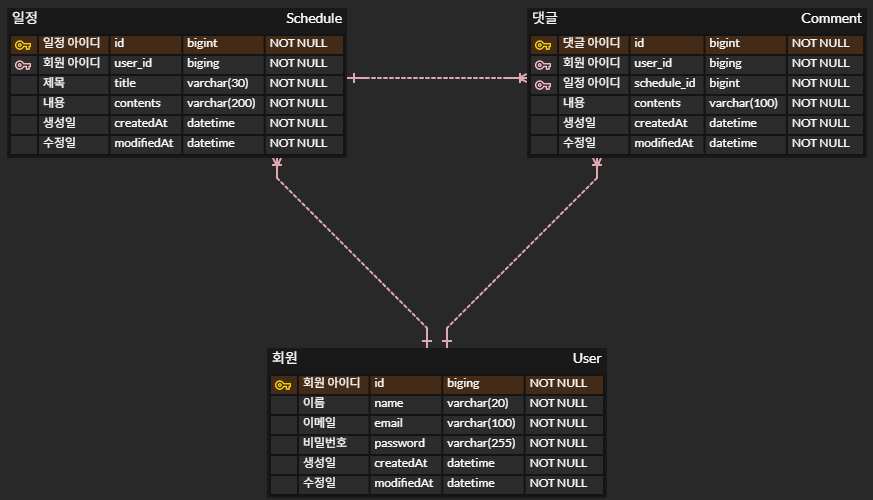

# 🗓️ 일정 관리 API

일정 관리 기능을 제공하는 Spring Boot 기반 RESTful API입니다.  
일정, 댓글, 유저 CRUD 및 입력값 유효성 검증 기능 등을 포함합니다.

---

## ✅ 주요 기능 요약

| **Lv** | **도메인 기능명** | **주요 내용** | **비고** |
|--------|------------------|---------------|----------|
| 1 | 일정 CRUD | 일정 생성 / 조회 / 수정 / 삭제, 작성 유저명·제목·내용·작성일·수정일 | 작성일·수정일 JPA Auditing |
| 2 | 유저 CRUD | 유저 생성 / 조회 / 수정 / 삭제, 유저명·이메일·작성일·수정일 | 작성일·수정일 JPA Auditing, 일정에 유저 식별자 사용 |
| 3 | 회원가입 | 유저 비밀번호 필드 추가 | 암호화는 Lv 6에서 수행 |
| 7 | 댓글 CRUD | 댓글 생성 / 조회 / 수정 / 삭제, 댓글↔유저↔일정 연관관계 | 작성일·수정일 JPA Auditing |
---

## 📚 기능 상세

### 📌 Lv 1. 일정 CRUD (필수)

- 일정 생성 / 조회 / 수정 / 삭제
- 필드: 작성 유저명, 할일 제목, 할일 내용, 작성일, 수정일
- 작성일·수정일 → JPA Auditing 적용

---

### 📌 Lv 2. 유저 CRUD (필수)

- 유저 생성 / 조회 / 수정 / 삭제
- 필드: 유저명, 이메일, 작성일, 수정일 (JPA Auditing 적용)
- 연관관계: 일정의 작성 유저명 대신 유저 고유 식별자 사용

---

### 📌 Lv 3. 회원가입 (필수)

- 유저에 비밀번호 필드 추가

---

### 📌 Lv 4. 로그인(인증) (필수)

- Cookie/Session 기반 로그인
- Filter로 인증 처리, @Configuration으로 필터 등록
- 회원가입/로그인 요청은 인증 필터에서 제외
- 로그인 조건: 이메일 + 비밀번호
- 실패 시: HTTP 401 반환

---

### 💬 Lv 5. 다양한 예외처리 (도전)

Validation 기반 다양한 예외 처리
예: 할일 제목 10자 이내, 유저명 4자 이내 등

---

### 💬 Lv 6. 비밀번호 암호화 (도전)

- 직접 구현한 PasswordEncoder로 비밀번호 암호화/검증
- 라이브러리: at.favre.lib:bcrypt:0.10.2

---

### 💬 Lv 7. 댓글 CRUD (도전)

- 일정에 댓글 생성 / 조회 / 수정 / 삭제
- 연관관계: 댓글 ↔ 유저 ↔ 일정
- 필드: 댓글 내용, 작성일, 수정일, 유저 식별자, 일정 식별자 (JPA Auditing 적용)

---

### 💬 Lv 8. 일정 페이징 조회 (도전)

- Spring Data JPA Pageable & Page 사용
- 쿼리 파라미터로 페이지 번호 / 크기 지정 (기본 크기: 10)
- 조회 필드: 할일 제목, 할일 내용, 댓글 개수, 일정 작성일, 수정일, 작성 유저명
- 수정일 기준 내림차순 정렬

---

## 🛠 기술 스택

- Java 17
- Spring Boot 3.x
- Spring Data JPA
- MySQL

---
## 📚 ERD

---

## 📚 API 명세서
https://seyoung5744.github.io/swagger-github-page/

## 📚 개선 사항

- **테스트 코드 작성** : Service, Domain 계층에 댛나 단위 테스트 추가
- **일정 삭제** : 현재 일정 삭제 시 연관된 댓글은 삭제가 안되고 있으므로 추후 댓글 삭제까지 고려

 